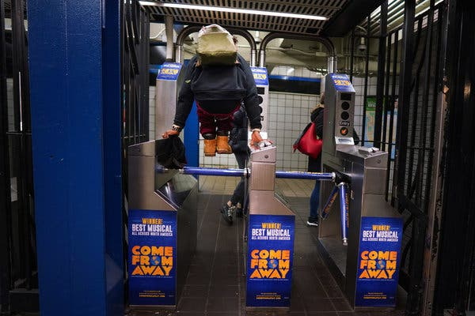
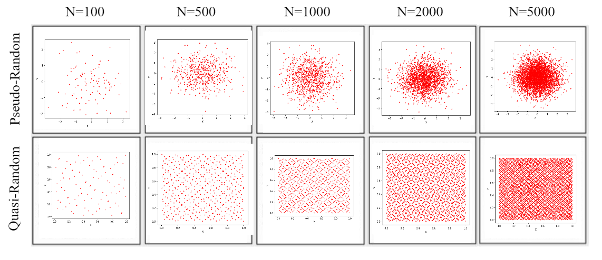
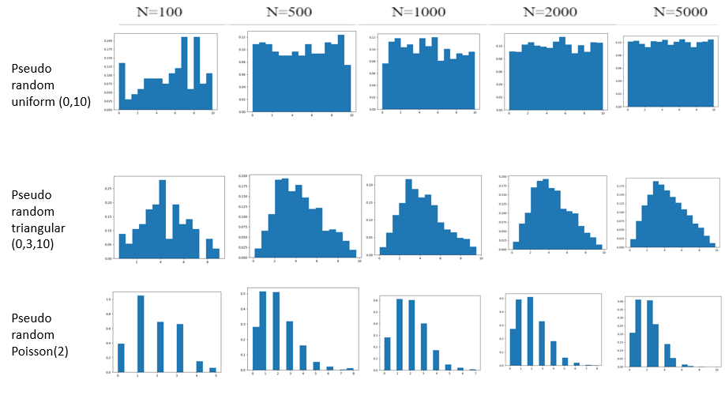

# Assignment 1 - Designing Models and Analyzing Data

> * Participant name: Allie Nizam
> * Project Title: Subway Turnstiles

# General Introduction

The first part of this assignment explores designing models (and basic Python/Git features). 

We will look at **subway model in a city** system. A **subway system** is an underground, tube, or metro, underground railway system used to transport large numbers of passengers within urban and suburban areas - modern subways use different types of electronic data collection sensors to supply information which is used to manage assets and resources efficiently. 

The second part of the assignment explores data analysis. Data analysis and visualization is key to both the input and output of simulations. This assignment explores different random number generators, distributions, visualizations, and statistics. Additionally, it will look at getting you accustomed to specifying input and output variables to a system. We will also practice working with real data.

# Part 1: Designing a Model - Subway System

It is important to look at the turnstiles in place in subway systems. The same turnstiles are used for passengers entering and exiting the subway system, and can often be the area of bottleneck concerns. What kind of turnstile system is most cost-effective to pass the users through as quick as possible, minimize fare evasion, and collect the payment or transaction accurately for those that pay?

There are various turnstile systems in place across the world. There are the common 3-arm or tripod rotating, full height glass, drop arm, and wing style turnstiles. The 2 most common ones are the tripod version, which historically is great for crowd control, but as users can jump over or sneak under, this method still needs manual supervision. The full height glass, or optical barrier, security method is much more difficult to defeat, but has a higer start up cost.

The botleneck issue in subway systems is a old as the subway system itself. This happens at the bi-directional turnstiles which are put up to curb fare evasion. Take for example the New York City subway - the first underground line opened back in 1904. There are several proposed solutions, not specific to the NYC subway system, but overall to crowd security control. Each method had its advantages and disadvantages, so must be analyzed for the specific application at hand.

## (Part 1.1): Requirements (Experimental Design) **(10%)**

* The simulation shall consist of 2 security turnstile methods - tripod arm and full height glass each with its own processing time per pedestrian.
* The system shall make use of the tunrstile formula: (P/M)/L = T, where P = # of people needing to process at peak time, M = minutes of peak flow, T = throughput capacity in people per minute per lane, and L = number of lanes.
* The simulation shall allow us to adjust the variables just listed for different times and methods.
* The simulation shall allow us to set for approximately 4 % of users committting fare evasion daily.

## (Part 1.2) Subway (My Problem) Model **(10%)**

My Model basically consists at the entry or exit area of a subway system, at the turnstile where the users must pass through. See below for the diagrams.

* [**Object Diagram**](model/object_diagram.md) - provides the high level overview of components. My object diagram consists of the turnstiles, the two types, and the users that pass through.
* [**Class Diagram**](model/class_diagram.md) - provides details of (what are you providing details of) My users are the people, their attribute is whether they paid fare or not. The turnstiles can be of 2 different types, and the action they have is to open to let passers through.
* [**Behavior Diagram**](model/behavior_diagram.md) - provides details of (what are you providing details of) This shows the use-case of the system. The person arrives at the turnstile. They will either evade the fare and pass somehow, or they will pay and the turnstile will allow passage.
* [**Agent / User case** (if appropriate)](model/agent_usecase_diagram.md) - provides details of (what are you providing details of)

## (Part 1.3) Subway (My Problem) Simulation **(10%)**

(remove: Describe how you would simulate this - including type of simulation, rough details, inputs, outputs, and how it will help you analyze your experimental hypothesis, or nullify your null hypothesis.)
This would be an example of discrete event based simulation as there are discrete events in this process - arrive, pay/evade, pass. Think of a queueing model. We will have a source that generates the agent with the rate of the arrival of people to the system, example exponential(2). Then we will have a queue section, the time people wait in line to reach the actual turnstile. Then we will have a delay section, which is the time to process their transaction at the turnstile. After that, they pass and exit the system. I can use realistic input variables and values from real world data sets - arrival and process rates. Outputs could be minimum, maximum, mean, and standard deviations of the waiting, processing, and total time in minutes; number of entities processed can also be captured. I can visually see the simulation data distribution and perform further statistical analysis to see which turnstile had a more significant reduction in processing times perhaps.

## (Part 1.4) Subway City (My Problem) Model **(10%)**
[**Code template**](code/README.md) - Starting coding framework for the (insert your exact problem here.)
You are expected to create the python files - the code should run without errors, create and object(s) for your system, but not provide function detail.

## (Part 1.5) Specifying the Inputs to a System **(10%)**

(remove the below points once ideas are satisfied)
* Specify the independent and dependent input variables of your subway esclator model
* Specify where the data will come from measured subset of real data (empirical) or synthetic data
* What kind of statistics are important to capture this input data
* How do you plan to analyze the output of your model?
* What ways will you visualize your data - charts, and graphs you will create?
* What clever way will you visualize your output with a useful infographic?

* Variables are the users and their payment status and which type of turnstile is used.
* The data for source arrival and processing rates can be synthetic data, such as arrival with exponential(2) meaning 0.5 per minute, but more realistically at rush hours could be 100 per minute or more.
* We will be most concerned with processing time in the system, so comparions of means will be very good to use as in T-test.
* It would be wise to keep a simple 2D plot of the distribution of processing times per type of turnstile.
* An infographic with the various types of turnstiles illustrated with the main pros and cons of each can be couple with basic statistics such as how many units are installed across the US and average processing time.

# Part 2: Creating a Model from Code

## (Part 2.1) **P**ortable **O**rganic **T**rouble-free **S**elf-watering System (**POTS**) Model **(10%)**
Here [**we provide an overview**](code/POTS_system/README.md) of the **P**ortable **O**rganic **T**rouble-free **S**elf-watering System (**POTS**) Model and provide a source code template for the code found in  [**the following folder**](code/POTS_system/). Please create a **class** diagram of this model (replace the placeholder diagram). (you can use paper and pencil or a digital tool).

# Part 3: Data Analysis

## (Part 3.1) - Real Data **(10%)**

Find a datasource that looks at part of this model - subway stations locations / escalator number, heights, widths / volume of passangers - ridership numbers   (*fits* - we are pretty loose here, it can be anything.)

* Write up a paragraph that describes the data and how it fits into your system.
* Load the data into Python
* Calculate a few useful statistic on the data - keep it simple- STD, means, etc..., this is just designed * to get used to working with real data. Explain the insights you derive from these statistics.
* Visualize the raw data - visualize a few critical aspects of the data to better describe what it is, what it is showing, and why its useful to your system.
* Calculate and plot some summary statistics that better describe the data.

(Add your plots and visualization here)
(Put your data into the data directory)

## (Part 3.2) -  Plotting 2D Random Number Generators **(15%)**

This portion of the assignment looks at generating random numbers in Python and understanding how to properly plot them. Plot two different random numbers, pseudo random and quasi random, for five different N values. There should be 10 subplots, all properly formatted 2D plots. Note, each of the N points will have two coordinates, an x and a y, therefore you will need to generate two random numbers for each point. You should replace the image with your results in a simalar format. Discuss how the patterns differ. Feel free to change the N values from the suggested N values in the image to state your case.

I used numpy and matplotlib to plot the first set of random numbers generated by the Mersenne twister algorithm. These plots came out as expected for random numbers. I used the sobol generator to get the quasi random plots, which came out as expected as seen below - more of a uniform and "adjusted" randomization.

## (Part 3.3) -  Plotting 1D Random Distributions **(15%)**

Now, choose three different distributions to plot in 1D, or as a histogram. Choose a pseudo-random generator and generate three different distributions. Example distributions are Uniform (part 8), Normal, Exponential, Poisson, and Chi-Squared, but feel free to use any three distributions of your choice. Again, plot each distribution for five different Ns. This will result in 15 different subplots, formatted similar to the image in Part 8. Include your properly formmated 1D plots below and breifly describe what we are looking at and how things change as N is changed.

As the N increases, we see out distributions get fuller to the shape that we expected.

Repeat the above using a quasi-random generator. Discuss the similarities and differences.
